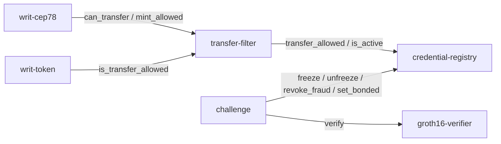

# Writ — System Architecture

Writ is the [ERC-3643](https://erc3643.org/) / T-REX-style compliance primitive for Casper.
Casper has joined the ERC-3643 Association (the standards body for compliant RWA tokenization),
and Writ is built in alignment with that standard. The stack is Odra (contracts), CSPR.click
(wallet), and CSPR.cloud (reads). The frontend is Next.js / React, deployed on Railway.

Live app: <https://writ-app-production.up.railway.app>  
App docs: <https://writ-app-production.up.railway.app/docs>

Cross-links: [README](./README.md) · [ADVERSARIAL_TESTING](./ADVERSARIAL_TESTING.md) · [DEPLOYMENT](./scripts/deploy/DEPLOYMENT.md)

---

## Table of contents

1. [The off-chain / on-chain split](#1-the-off-chain--on-chain-split)
2. [The six contracts](#2-the-six-contracts)
3. [Data flow: onboard → attest → gated transfer → revoke → challenge → disclosure](#3-data-flow)
4. [Server-side quorum auto-attest](#4-server-side-quorum-auto-attest)
5. [Trust model](#5-trust-model)
6. [Economics and incentive invariants](#6-economics-and-incentive-invariants)
7. [Credential state machine](#7-credential-state-machine)
8. [Selective disclosure](#8-selective-disclosure)
9. [Test coverage](#9-test-coverage)

---

## 1. The off-chain / on-chain split

This is the most important thing to understand about Writ.

**Off-chain** — at onboarding time:

- The investor's identity secret and salt are derived from a **wallet signature in
  the browser** (`frontend/lib/identity.ts`) and never leave it; the server only
  ever sees `Poseidon(identitySecret)`. The demo issuer signs the claim set for
  that commitment (`frontend/lib/server/issuer-input.ts` — key required via env,
  fails closed; **no external KYC provider is integrated**).
- The investor generates the Groth16-BN254 eligibility proof entirely in-browser
  using snarkjs from the locally assembled witness.
- The Next.js API route (server-only, Railway) verifies a **mandatory nonce-bound
  wallet signature** proving control of the account (`frontend/lib/server/bind.ts`,
  blocking + single-use), verifies the proof, binds all six public inputs to the
  pinned issuer/asset/root, and runs sanctions screening
  (`frontend/lib/server/screen.ts` — live OFAC ETH list for a linked address,
  labeled demo denylist for Casper accounts, fail-closed on stale data). Then two
  attestation signatures are produced by env keys held by this one server process
  (`frontend/lib/server/quorum-attest.ts`) — **a single trust domain, not an
  independent quorum**.
- The on-chain registry stores the holder's own proof and public inputs but
  **does not run a SNARK at attest time**.

**On-chain** — at attest time:

- The registry `attest` entrypoint verifies ed25519 quorum signatures and the public-input binding (`pi[0..32] == nullifier`, `pi[32..64] == commitment`). It records the commitment, nullifier, signer set, expiry, and the stored proof.
- The on-chain Groth16 pairing check runs **only in the fraud-challenge path**: `challenge.resolve` reads the credential's own stored proof from the registry, calls `groth16_verifier.verify`, and slashes or clears accordingly.

The honest framing: **verify off-chain, commit on-chain; re-verify on-chain only to adjudicate fraud.**

---

## 2. The six contracts

All six are live on `casper-test`. Package hashes (stable addresses) link to the explorer.

### 2.1 groth16-verifier

**Source:** `contracts/groth16-verifier/src/verifier.rs`  
**Package hash:** [`2bc9a855…`](https://testnet.cspr.live/contract-package/2bc9a8556c75ee912bab4f7d2cf2622863d1f1e29eb5cf68685a52d6a718ff61)

Performs the Groth16-BN254 pairing check as pure-WASM arkworks inside the contract (Casper testnet has no native EC pairing host function in `vm_casper_v1`). The eligibility circuit's verifying key is compiled in as an immutable constant (`VK_BYTES = include_bytes!("../fixtures/vk_uncompressed.bin")`); it cannot be swapped after install.

Public interface: one entrypoint.

```
verify(proof: Bytes, public_inputs: Bytes) -> bool
```

`public_inputs` is 6 × 32-byte BN254 scalar-field elements (little-endian), canonical circuit order: `[nullifier, commitment, issuerAx, issuerAy, assetId, allowedRoot]`. Deserialization of caller-supplied material is **checked** (on-curve + subgroup for proof points, canonical range for field elements — added in the hardening pass; the deployed testnet instance predates this and is scheduled for redeploy, disclosed in README §12). Any malformed input returns `false`; it never panics or reverts.

**Called exclusively by the challenge contract's `resolve` path.** It is never called at onboarding.

Measured gas for a full pairing verify on the Casper EE: **~79.29 CSPR**.

### 2.2 credential-registry

**Source:** `contracts/credential-registry/src/registry.rs`  
**Package hash:** [`2e19e2bf…`](https://testnet.cspr.live/contract-package/2e19e2bfc5383fd51103ee54fb430b53ec7a1a63c83a7841e08f00b188653fca)

The on-chain heart of the compliance layer. Stores per-holder eligibility credentials keyed by `(asset_id, holder)`. Each `Credential` holds:

- `commitment: [u8; 32]` — Poseidon(claims, salt), the privacy anchor
- `nullifier: [u8; 32]` — Poseidon(identitySecret, assetId), the Sybil barrier
- `status: Status` — the credential lifecycle state
- `expiry: u64`, `attested_at: u64`
- `signers: Vec<PublicKey>` — which bonded quorum keys co-signed (joint liability for fraud)
- `proof: Bytes`, `public_inputs: Bytes` — stored for fraud adjudication
- `frozen_by_challenge: bool` — distinguishes a challenge-initiated freeze from an officer hold

**Roles** (Odra `AccessControl`):

| Role | Holder | Authority |
|---|---|---|
| `QUORUM_ROLE` | Agent operator account | `attest`, `revoke` |
| `OFFICER_ROLE` | Compliance officer account (demo: a single key; production: Casper M-of-N associated-key multisig) | `officer_freeze/unfreeze/revoke/reinstate`, `freeze_asset/unfreeze_asset` |
| `CHALLENGE_ROLE` | Challenge contract | `freeze`, `unfreeze`, `revoke_fraud`, `set_bonded` |
| `DEFAULT_ADMIN_ROLE` | Deployer (renounced post-wiring) | `grant_challenge`, `grant_officer`, `revoke_role` |

Key entrypoints:

- `attest` — writes a credential after verifying quorum ed25519 signatures over the canonical message and enforcing the public-input binding (`pi[0..64]` always; `pi[64..192]` against the pinned issuer/asset/root when `set_canonical_inputs` has been called).
- `set_canonical_inputs` — admin-gated pinning of the canonical issuer key + allowed root; once set, an attest carrying public inputs for a forged issuer, another asset, or a different root reverts `CanonicalInputMismatch` (hardened build; the deployed testnet instance predates this entrypoint).
- `revoke` — immediate sanctions revocation; callable by quorum or officer.
- `revoke_fraud` — terminal fraud state; callable only by the challenge contract.
- `freeze` / `unfreeze` — challenge-layer dispute management; suspends expiry.
- `officer_freeze/unfreeze/revoke/reinstate` — human override with `OfficerAction` event trail.
- `settle_expired` — permissionless keeper: materializes an elapsed credential into `Expired`.
- `is_active(asset_id, holder) -> bool` — the primary read the transfer filter calls.
- `transfer_allowed(asset_id, from, to) -> bool` — the gate the filter delegates to.
- `transfer_check(asset_id, from, to) -> TransferReason` — diagnostic twin for the issuer dashboard.

### 2.3 challenge

**Source:** `contracts/challenge/src/challenge.rs`  
**Package hash:** [`c1080d67…`](https://testnet.cspr.live/contract-package/c1080d67eed0c4945eadd84bc016d3b183a650086e39de60fb9c96cfe59dda34)

The optimistic fraud-proof layer. Attestations are accepted optimistically; anyone who believes an attestation is fraudulent can open a dispute.

Entrypoints:

- `bond(attestor)` — payable; attestor posts exactly `attestor_bond` CSPR and is mirrored as bonded in the registry. Only bonded keys may serve as quorum signers.
- `withdraw(attestor)` — returns bond only when `attestor_outstanding == 0` (no still-challengeable credentials) and the cooldown has elapsed. Prevents attest-fraud-then-flee.
- `challenge(asset_id, holder)` — payable (exactly `challenger_bond` CSPR); must target an `is_active` credential. Freezes the credential via the registry (first-challenge-wins, enforced by the registry's `NotFreezable` guard on already-frozen credentials).
- `resolve(asset_id, holder)` — anyone may call; reads the credential's own stored proof and public inputs from the registry and calls `groth16_verifier.verify`. Idempotent (reverts on second call). Effects (state flips) precede interactions (CSPR moves).
- `settle_expired(asset_id, holder)` — exposes the registry keeper function.

Fraud resolution: proof **invalid** → `revoke_fraud`; full signer bond pool slashed; challenger receives gas allowance + reward + bond refund; remainder **transferred to the treasury account** (a spendable account — a treasury transfer, not a burn).

Frivolous challenge resolution: proof **valid** → credential unfrozen (Active, or Expired if expiry elapsed during freeze); challenger's bond split among signers as compensation.

### 2.4 transfer-filter (writ_registry_filter)

**Source:** `contracts/transfer-filter/src/filter.rs` (Odra adapter) and `contracts/writ-cep78/fork/contracts/test-contracts/writ_registry_filter/src/main.rs` (production CEP-78 hook)  
**Package hash:** [`d84a9321…`](https://testnet.cspr.live/contract-package/d84a932187624c1c982ed5c6dcbd1961fe370f732ce02fcbc0fe3e5e28389726)

The CEP-78 `transfer_filter_contract`. On every transfer the token calls:

- `can_transfer(source_key, target_key) -> u8` — delegates to `registry.transfer_allowed(asset_id, from, to)`. Returns `1` (proceed) or `0` (deny). A revert in the registry call propagates and aborts the entire NFT operation (fail-safe deny).
- `mint_allowed(target_key) -> bool` — delegates to `registry.is_active(asset_id, holder)`. Mint is gated separately from transfer.

The filter is **recipient-aware**: it checks both sender and recipient eligibility. A transfer to an ineligible recipient is denied regardless of the sender's status. The filter holds no policy of its own; it is bound to one registry package hash and one `asset_id` at install time.

**Fail-safe deny**: any registry revert (sanctioned party, network issue) propagates and the NFT operation does not proceed.

### 2.5 writ-cep78

**Source:** `contracts/writ-cep78/fork/`  
**Package hash:** [`ad407c6b…`](https://testnet.cspr.live/contract-package/ad407c6bccbfc13e9fef28a03b75b175b0d186d3205952be684934c8dcb59bbe)

The RWA bond NFT. A real CEP-78 implementation wired to the transfer-filter contract (`transfer_filter_contract` install argument). Mint is gated by `mint_allowed`; every transfer is gated by `can_transfer`. The fork is the production-deployed contract; the `writ_registry_filter` test contract in the fork tree is the compatibility shim that exposes the `can_transfer` / `mint_allowed` entrypoints the CEP-78 spec requires.

### 2.6 writ-token

**Source:** `contracts/writ-token/src/token.rs`  
**Package hash:** [`512068de…`](https://testnet.cspr.live/contract-package/512068de722212ce497cb081049649339f0a8994394328164f3dde52c4ab8a3e)

An Odra-native filter-gated token used in the integration test suite (`contracts/integration/`). Captures the one property the integration cares about: every `transfer` call consults the configured filter, which delegates to the registry compliance gate. A transfer to or from an ineligible party reverts with `TransferDenied`. This contract is the EE-testable model of the CEP-78 behavior; the live RWA NFT on testnet uses writ-cep78.

---

## 3. Data flow

```mermaid
sequenceDiagram
    participant Browser
    participant Server as Next.js API (Railway, server-only)
    participant Registry as credential-registry (on-chain)
    participant Filter as transfer-filter (on-chain)
    participant CEP78 as writ-cep78 (on-chain)
    participant Challenge as challenge (on-chain)
    participant Verifier as groth16-verifier (on-chain)

    Note over Browser,Server: ONBOARD
    Browser->>Browser: wallet signs derivation msg -> identitySecret/salt (stay local)
    Browser->>Server: POST /api/bind (account) -> single-use nonce
    Browser->>Server: POST /api/claims (bind sig, idCommit = Poseidon(secret))
    Server->>Server: verify bind (BLOCKING); demo issuer signs claims for idCommit
    Server->>Browser: signed claim set (no secrets)
    Browser->>Browser: snarkjs.groth16.fullProve() — witness + proof stay in browser

    Note over Browser,Server: ATTEST
    Browser->>Server: POST /api/onboard (bind sig, proof, publicSignals)
    Server->>Server: verify bind (consume nonce) + snarkjs verify +\n  bind all 6 public inputs + sanctions screen (fail-closed)
    Server->>Server: co-sign with 2 env keys (single trust domain)
    Server->>Registry: attest(asset_id, holder, commitment, nullifier,\n  expiry, HOLDER'S proof bytes, public_inputs, signers, sigs)
    Registry->>Registry: verify sigs vs registered 3-key set + public-input binding;\n  store credential (status=Attested)

    Note over CEP78,Registry: GATED TRANSFER
    CEP78->>Filter: can_transfer(source_key, target_key)
    Filter->>Registry: transfer_allowed(asset_id, from, to)
    Registry-->>Filter: bool (checks sender + recipient is_active)
    Filter-->>CEP78: 1 (proceed) or 0 / revert (deny)

    Note over Registry: REVOKE
    Server->>Registry: revoke(asset_id, holder) [sanctions re-screen hit]
    Registry->>Registry: status → Revoked

    Note over Challenge,Verifier: FRAUD CHALLENGE
    Challenge->>Registry: freeze(asset_id, holder) [status → Frozen]
    Challenge->>Registry: cred_proof / cred_public_inputs / cred_signers
    Challenge->>Verifier: verify(proof, public_inputs)
    alt proof INVALID (fraud)
        Verifier-->>Challenge: false
        Challenge->>Registry: revoke_fraud(asset_id, holder)
        Challenge->>Challenge: slash signer bonds; pay challenger;\n  transfer remainder to treasury account
    else proof VALID (frivolous)
        Verifier-->>Challenge: true
        Challenge->>Registry: unfreeze(asset_id, holder)
        Challenge->>Challenge: slash challenger bond; compensate signers
    end

    Note over Browser: DISCLOSURE
    Browser->>Browser: holder reveals claims preimage to regulator peer-to-peer
    Browser->>Browser: regulator recomputes Poseidon(claims) vs on-chain commitment
```

### Contract dependency graph



---

## 4. Server-side attestation (single trust domain — stated plainly)

**Source:** `frontend/lib/server/quorum-attest.ts`

The server holds two of the three registered quorum keys as environment variables
(base64-encoded PEM, never imported client-side) and produces **both** signatures
itself. This is a 2-signature demo attestation from one trust domain; the
on-chain registry independently verifies both signatures against its registered
3-key set with threshold 2 and accepts only bonded signers. The `submitAttest`
function:

1. Derives `commitment` and `nullifier` from the circuit's public signals using `fieldToLe32` (bigint field element → 32-byte little-endian buffer, matching the on-chain `ByteArray` encoding).
2. Constructs the canonical message: `strBytes(asset_id) || keyAccountBytes(holderHex) || commitment[32] || nullifier[32] || u64le(expiry)`. This is byte-exact with the Rust `canonical_message` function in `registry.rs`.
3. Signs the message with each of the two env quorum keys using `@noble/curves/ed25519`, prefixing signatures with the `01` algorithm tag.
4. Builds and signs a Casper `put_deploy` via `casper-js-sdk` targeting the registry package hash by `newStoredVersionContractByHash`.
5. Submits via raw JSON-RPC (`account_put_deploy`), avoiding the SDK's own RPC client (incompatible with the Next.js server runtime).

The proof is stored on-chain but not re-verified by the registry at attest time. The off-chain snarkjs verify (step in the API route before calling `submitAttest`) is the verification gate.

Supporting server-only modules:

| File | Purpose |
|---|---|
| `frontend/lib/server/screen.ts` | Sanctions screening with honest scope: the live OFAC SDN ETH-address list (content-hash + timestamp versioned) is screened against an optional linked ETH address — an identifier that can actually match; Casper-account matching uses a labeled demo denylist. Stale (>24h) or unavailable data refuses attestation (fail-closed). |
| `frontend/lib/server/issuer-input.ts` | The demo issuer. Signs the claim set for a **client-supplied** identity commitment `Poseidon(identitySecret)`; never sees or derives the identity secret or salt, so it cannot rebuild the witness. Fails closed without `ISSUER_EDDSA_KEY` (no default key exists in the repo). |
| `frontend/lib/identity.ts` (client) | Derives `identitySecret`/`salt` from a wallet signature in the browser; computes the identity commitment with circomlibjs. The derivation signature is never transmitted. |
| `frontend/lib/server/bind.ts` | **Mandatory, blocking** wallet-control verification: server-issued single-use nonce, domain-separated message (chain/registry/asset/account/nonce/expiry), ed25519 + secp256k1 signature check, replay rejection. No claims and no attest without it. |
| `frontend/lib/server/proof-serde.ts` | Converts the verified snarkjs proof to the exact arkworks-uncompressed bytes stored on-chain (proven byte-for-byte against the Rust `gen_fixtures` output). **The stored proof is always the holder's own** — no placeholder path exists. |
| `frontend/lib/server/guards.ts` | Per-key sliding-window rate limit, per-wallet one-shot cap, global soft cap. In-memory (single Railway replica). |

---

## 5. Trust model

### What is on-chain and publicly readable

- The credential commitment `Poseidon(accredited, jurisdictionCode, sanctioned, identitySecret, salt)` — a field element, not PII.
- The nullifier `Poseidon(identitySecret, assetId)` — a field element, binds the holder to one slot per asset.
- Credential status (`Attested`, `Active`, `Revoked`, `RevokedFraud`, `Frozen`, `Expired`).
- The six public inputs (nullifier, commitment, issuerAx, issuerAy, assetId, allowedRoot) — circuit outputs, no PII.
- The stored Groth16 proof bytes (used only by `challenge.resolve`).
- Event trail: `CredentialAttested`, `CredentialRevoked`, `OfficerAction`, `Challenged`, `Resolved`.

### What is never on-chain

- Raw claims (accredited status, jurisdiction code, identity secret).
- The issuer EdDSA private key.
- Any ciphertext escrow (disclosure is commitment-only; see §8).

### Attestation signers (demo: single trust domain)

The registry registers three ed25519 keys with threshold 2. **In this demo both
signing keys live in one server process's env** — there is no independent
verifier quorum, and the docs/UI say so. What the chain enforces is real: ≥2
valid signatures from the registered set, bonded signers only, unknown/duplicate
signers rejected. The `agent/` directory implements the independent N-verifier
shape used by the CLI/e2e path; distributing key custody to such services is the
production model.

**Only bonded keys may sign.** A quorum key must post `attestor_bond` CSPR in the challenge contract before it can co-sign a credential. This creates joint economic liability for every attestation.

**Withdraw guard.** A key with any still-challengeable credential (`attestor_outstanding > 0`) cannot withdraw its bond. The outstanding counter decrements when a credential is revoked, expires, or a dispute resolves.

### Officer

The `OFFICER_ROLE` is a Casper account hash; the contract trusts that account. The production model puts a weighted M-of-N multisig (Casper associated keys) behind it — `scripts/officer_multisig/setup_and_demo.sh` demonstrates the native mechanism — but **the deployed demo officer is a single key**, stated plainly here and in the UI. Every officer action emits an `OfficerAction` event with a `reason_hash` committing to the off-chain justification.

Hard boundary: the officer **cannot** unfreeze a credential frozen by an in-flight challenge (`frozen_by_challenge == true`). A disputed credential can only be unfrozen by the challenge contract after `resolve` runs.

Hard boundary: the officer **cannot** produce or alter `RevokedFraud`. That state is exclusively the challenge contract's output.

### Challenge contract authority

`CHALLENGE_ROLE` is held exclusively by the challenge contract (post-wiring). The admin renounces `DEFAULT_ADMIN_ROLE` and `CHALLENGE_ROLE` from the deployer key after wiring so no single key retains that authority.

### Re-screening

Screening runs at onboarding and refresh only — there is no autonomous background
daemon polling the holder population. Scope, honestly: the live OFAC SDN
digital-currency list contains **ETH addresses**, so it is screened against an
optional linked ETH address; Casper-account matching uses a labeled demo
denylist (illustrative — no official Casper-account SDN mapping exists). Every
screening result records source URL, fetch timestamp, and list content hash;
stale or unavailable data refuses attestation.

---

## 6. Economics and incentive invariants

All values are constructor arguments; the testnet demo uses 250 CSPR bonds for convenience. The documented production defaults are in `challenge.rs`.

| Parameter | Testnet demo | Source |
|---|---|---|
| `attestor_bond` | 250 CSPR | `ATTESTOR_BOND_CSPR` in `challenge.rs` |
| `challenger_bond` | 250 CSPR | `CHALLENGER_BOND_CSPR` |
| `reward` | 300 CSPR | `REWARD_CSPR` |
| `gas_allowance` | 90 CSPR | `GAS_ALLOWANCE_CSPR` (covers full `resolve` gas at ~79.29 CSPR) |

**Fraud outcome (2 signers, testnet bonds):**

- Slashed pool: 2 × 250 = 500 CSPR.
- Challenger receives: min(gas_allowance + reward, slashed) + bond = min(390, 500) + 250 = 640 CSPR.
- Treasury transfer: 500 − 390 = **110 CSPR** (to the configured treasury account — spendable, not destroyed).

**Griefing invariant:** `A = G + R + B`. A successful challenger is made whole on gas (G), earns the reward (R), and is refunded their bond (B). The rest goes to the treasury.

**Self-slash deterrence:** A signer who self-challenges loses the full signer bond minus the reward and gas allowance, making sockpuppet challenges strictly net-negative. Test: `challenge::tests::self_challenge_is_net_negative`.

**First-challenge-wins:** The registry's `freeze` entrypoint (`CHALLENGE_ROLE` only) rejects a freeze on an already-Frozen credential with `NotFreezable`. This prevents a second challenger from opening a dispute on a credential already in dispute.

**Exit-scam guard:** The withdraw guard (`HasOutstanding`) prevents a signer from posting a fraudulent attestation and immediately withdrawing their bond.

---

## 7. Credential state machine

```
                     ┌──────────┐
                     │ Pending  │  (default; no credential written)
                     └────┬─────┘
                          │ attest (quorum signed, bonded signers)
                          ▼
                     ┌──────────┐
                     │ Attested │  challenge window not yet elapsed
                     └────┬─────┘
        window elapsed    │         challenge() [CHALLENGE_ROLE]
              ┌───────────┘─────────────────────────────────┐
              ▼                                              ▼
         ┌────────┐                                    ┌────────┐
         │ Active │◄────── unfreeze (valid proof) ─────│ Frozen │
         └────┬───┘                                    └────┬───┘
              │                                            │
     revoke() │ or officer_revoke()           resolve()    │ (proof invalid)
              ▼                                            ▼
         ┌─────────┐                              ┌──────────────┐
         │ Revoked │◄── officer_reinstate ──      │ RevokedFraud │ (terminal)
         └────┬────┘  (non-expired only)          └──────────────┘
              │
    expiry    │ elapsed or settle_expired()
              ▼
         ┌─────────┐
         │ Expired │
         └─────────┘
```

Notes on specific transitions:

- `Frozen` → `Active` or `Expired`: the challenge contract's `unfreeze` checks expiry; if the credential's `expiry` elapsed while it was frozen, it lands in `Expired` (freeze suspends expiry, never extends it).
- `Revoked` → `Active`: officer reinstatement only; only a non-expired `Revoked` (sanctions/manual) credential can be reinstated. `RevokedFraud` can never be reinstated.
- `Frozen` by challenge vs officer: `frozen_by_challenge` flag distinguishes the two. Officer cannot unfreeze a challenge-frozen credential (`ChallengePending` error).

---

## 8. Selective disclosure

**Source:** `disclosure/src/disclosure.js`

Disclosure is Poseidon-commitment-only. There is no ciphertext escrow in the registry and no PII stored on-chain.

**Voluntary peer-to-peer disclosure:**

1. The holder reveals the claims preimage `{accredited, jurisdictionCode, sanctioned, identitySecret, salt}` directly to the regulator.
2. The regulator calls `verifyDisclosure(pkg, onchainCommitment)`, which recomputes `Poseidon(claims, salt)` using the same `circuits/commitment.js` library used at onboarding.
3. If `recomputed === onchainCommitment` (byte-for-byte; the on-chain `ByteArray` is the little-endian encoding of the field element), the claims are provably the committed ones. Any tampered claim or salt produces a different commitment.

The disclosure suite (`disclosure/src/test_disclosure.js`) reuses the same Poseidon/commitment library as the live onboarding path, and recomputes the commitment for the live on-chain credential (`f3fd7cbba19ef1195d70df72bc3ea073da4b6f78899c261ffadbc305d7a86645`) byte-for-byte.

---

## 9. Test coverage

| Suite | Count | Notes |
|---|---|---|
| `credential-registry` | 57/57 | RBAC, sig validation, nullifier replay, binding (incl. canonical issuer/asset/root pinning), expiry, state machine, transfer matrix |
| `challenge` | 18/18 | Bonding, withdraw guard, fraud/frivolous resolve, idempotency, expiry-under-freeze, self-slash deterrence |
| `groth16-verifier` | 8/8 | Valid/tampered proof + inputs; checked-deserialization rejections (malformed, off-curve, out-of-subgroup, non-canonical) |
| CEP-78 ⇄ filter ⇄ registry E2E | fork `writ` tests | Real-EE gating incl. revoked sender, expired credential, operator no-bypass, missing-registry fail-closed |
| `integration` lifecycle | 1 chained scenario | attest → active → gated transfer → revoke → re-attest → fraud challenge → slash → treasury transfer |
| `frontend` | 28/28 | bind, fail-closed issuer, screening, proof serde vs arkworks bytes, full in-node prove + input binding |
| `disclosure` | 14/14 | Poseidon recompute vs live on-chain commitment, tamper detection, compelled disclosure round-trip |

Real gas measurements from the Casper EE:

- On-chain Groth16 `verify`: **~79.29 CSPR**
- Fraud-slash treasury transfer: **110 CSPR** (testnet demo bond sizes)

Live testnet transaction proofs:

| Scenario | Deploy hash |
|---|---|
| Regulated holder attest (real Poseidon commitment) | [`f3fd7cbb…`](https://testnet.cspr.live/deploy/f3fd7cbba19ef1195d70df72bc3ea073da4b6f78899c261ffadbc305d7a86645) |
| Transfer from sanctioned sender reverts (filter error 159) | [`3448182c…`](https://testnet.cspr.live/deploy/3448182cb432dd4278551dc378a8485c7ee9cb09b3c619101ea37efb34a17b1d) |
| Transfer to ineligible recipient reverts (recipient-aware deny, error 159) | [`ce0f1a3a…`](https://testnet.cspr.live/deploy/ce0f1a3a03131a4de663d04d60243aa4c261a9f0eab24acf55a4f5af9a26a2ad) |
| Fraud slash (resolve → Groth16 FALSE → slash 500, 110 CSPR treasury transfer) | [`0ae7aecd…`](https://testnet.cspr.live/deploy/0ae7aecdf9510e34db2e6a2f392630843bbd11176f067124d01f2012d0e00c83) |
